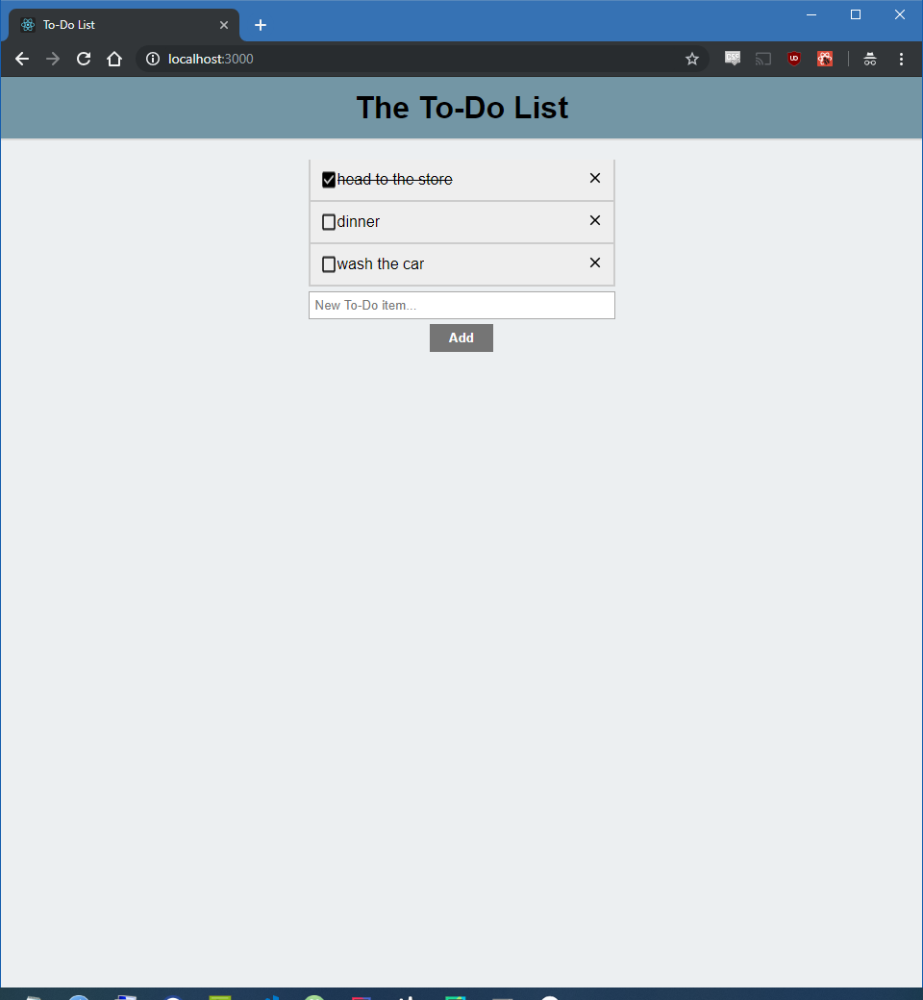

# To-Do List web app
This is currently a super simple React front-end that allows the user to create a to-do list by adding and deleting items, and marking them as completed.

### Example:

## TODO:
Currently working on creating a simple backend deployment using MongoDB to allow persistence, as well as stylistic changes.